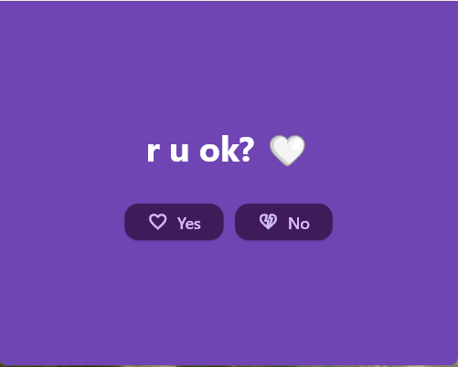
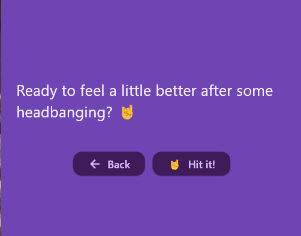

# 🤘 **R U OK?** – The Heavy Metal Mood Booster!

Welcome to **R U OK?**, the **loudest**, most **metal** way to check in on your mood! Whether you're **pumped up** or need a **boost**, this app has your back—with a playlist to shake off the blues and a UI that keeps things **tight**.


## 🚀 **Features That Rock**  
- 🎸 **Mood Check:** Hit `"Yes"` or `"No"`—because sometimes you just need a riff to lift you up.  
- 🤘 **Custom Responses:** Get messages that scream motivation or whisper encouragement (depends on your vibe).  
- 🎶 **Music Integration:** Auto-plays **Spotify tracks** designed to power you up when you're feeling low.  
- 🎨 **Styled UI:** Sleek and clean design because even your interface should look good.  
- ⚡ **Metal Attitude:** The app throws down some **heavy vibes** to match your energy level!  

## 📸 **Screenshots That Speak Loud**  
🔥 **The Beginning of an Epic Journey:**  
  

🎧 **Let the Music Take Over:**  
  

## 🛠 **How to Install**  
1. **Clone this bad boy:**  
   ```bash
   git clone YOUR_REPO_URL
   cd r_u_ok

- Summon Dependencies:
flutter pub get

- Launch the Madness:
flutter run

🤘 Let’s Keep It Metal! 

Built in Flutter, because smooth performance matters as much as a perfect guitar solo.
Fueled by Spotify, because life sounds better with music.
Powered by me, angiemelo.